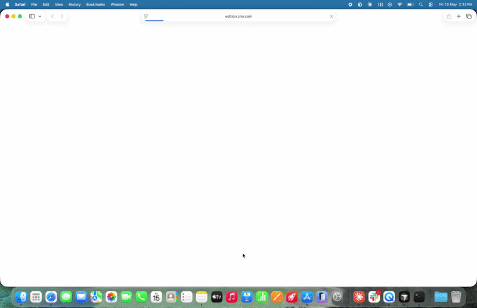

# Daily News Digest

## Description

Opens your default browser, visits CNN, NY Times, BBC News, The Guardian, and Hacker News in sequence, and scrapes the top headlines from each using the OS accessibility tree. The results are formatted into a dated digest and written directly into a new Apple Notes note. No API keys required.

## Demo



## Key APIs Used

- `App.defaultBrowser().open()` — opens a URL in the user's default browser and returns a live process handle
- `instance.enableAccessibility()` — activates the accessibility tree for the browser process (required before reading)
- `AccessibilityTree.fromForeground()` — attaches to the currently active window, which is more reliable than `fromPid()` for multi-process browsers like Chrome
- `tree.find(order, role, ...)` — walks the accessibility tree and returns nodes matching an ARIA role (`Heading`, then `Link` as fallback)
- `App.exactName('Notes').open()` — launches Apple Notes
- `KeyboardController` + `Key.Meta` — sends Cmd+N to create a new note
- `Clipboard.pasteText()` — pastes a long string via the clipboard without permanently replacing its contents

## How to Run

**Prerequisites:**

- Simulang installed (`simulang run` available in your terminal)
- macOS (uses Apple Notes and macOS accessibility APIs)
- No API key required

**Steps:**

1. `cd daily-news-digest`
2. `npm install`
3. `simulang run main.ts`

The script opens each site for ~3.5 seconds to let the accessibility tree render, so it takes around 20 seconds end-to-end. When it finishes, open Apple Notes — the digest will be the newest note.

Tip: run `simulang run -i` to open an interactive REPL and explore the accessibility tree of any open window before writing a script.

## Workflow Diagram

```
For each news source:
  [Open URL in browser] → [enableAccessibility()] → [wait 3.5s]
  → [fromForeground()] → [find(Heading) or find(Link)]
  → [clean + filter headlines]

[Format digest] → [Open Notes] → [Cmd+N] → [pasteText()]
```

## Notes

- **NYT paywall** — only headlines visible without a login are captured. Expect fewer results there than other sources.
- **Noise filtering** — accessibility trees are noisy: they include nav links, skip links, image alt texts, video durations, and photo captions alongside real headlines. The `clean()` function normalises raw text (strips video durations, newlines, timestamps) and the `NOISE` array filters known junk patterns. If a site redesigns and odd entries reappear, those are the two places to tweak.
- **Adding sources** — extend the `SOURCES` array with any `{ label, url }` pair. Sites that don't use heading tags (like Hacker News) are handled automatically by the `Link` fallback.
- **Chrome vs Safari** — tested with Chrome. Safari exposes its accessibility tree slightly differently; if you hit issues, try switching your default browser.
