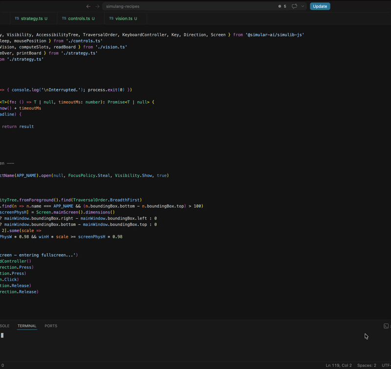

# 2048 Player

An Expectimax bot that plays [2048 by Ketchapp](https://apps.apple.com/sg/app/2048/id840919914) from the Mac App Store. Uses vision grounding to navigate the UI and the accessibility tree to read the board state each move.

## Demo

<!-- A GIF or video showing the automation running -->


## Key APIs Used

- `App.exactName().open()` — launches and focuses the 2048 app
- `screenshot.ground(model, concept)` — locates the menu button, new game button, and board center by visual description
- `AccessibilityTree.fromForeground()` — reads tile values and positions every move
- `MouseController` — clicks UI elements; simulates swipes via press → drag → release
- `Screen.mainScreen().dimensions()` — detects whether the window is already fullscreen
- `KeyboardController` — sends `Ctrl+Cmd+F` to enter fullscreen if needed

## How to Run

**Prerequisites:**
- simulang installed (`simulang run` available in your terminal)
- 2048 by Ketchapp (Designed for iPad) installed from the Mac App Store
- set your `OPENROUTER_API_KEY`
- macOS screen recording permission granted to your terminal

**Steps:**
1. `cd mac-2048-player`
2. `simulang run main.ts`

**To stop:** move your cursor outside the game board, or change to another window

## Workflow Diagram

```
[Launch app] → [Enter fullscreen if needed]
  → [Ground menu button → click]
  → [Ground new game button → click]
  → [Compute grid slots from accessibility tree landmarks]
  → [Ground board center for swipe coordinates]
  → loop:
      [Read tiles from accessibility tree]
      → [Expectimax depth-3 → pick direction]
      → [Swipe]
      → [Poll tree until board changes]
      → [Stop if: cursor left grid | game over | no tiles found]
```

## Notes

- **Why grounding + accessibility tree?** The Mac App Store version of 2048 exposes tile values through the accessibility tree — ideal for reading game state with no model calls. But the buttons have no accessible names, so grounding fills that gap for UI navigation.
- **Swipe distance:** `SWIPE_DISTANCE` in `controls.ts` is in physical pixels. Increase it if swipes don't register.
- **Strategy depth:** `DEPTH_LIMIT` in `strategy.ts` controls Expectimax search depth. `2` is fast, `3` plays stronger.
