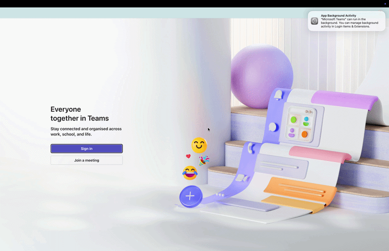

# Nudge

## Description

Keeps your presence status active by making a small, imperceptible cursor movement every 30 seconds. The cursor always snaps back to exactly where you left it — so it never interrupts your work. Works with any app that reads mouse activity to determine idle status (Teams, Slack, Zoom, and others). No API keys required.

## Demo



## Key APIs Used

- `MouseController.location()` — reads the current cursor position before moving
- `MouseController.moveMouse(x, y, Coordinate.Abs)` — moves the cursor to an absolute position, used to nudge and then restore

## How to Run

**Prerequisites:**

- Simulang installed (`simulang run` available in your terminal)
- No API key required
- Run `npm install` once in this folder

**Run indefinitely** (stop with Ctrl+C):

```bash
simulang run main.ts
```

**Run for a fixed duration:**

```bash
NUDGE_DURATION_MIN=60 simulang run main.ts
```

## Workflow Diagram

```
[Read cursor position] → [Move +30px right] → [Wait 300ms]
→ [Restore original position] → [Wait 30s] → [Repeat]
```

## Notes

- **Interval** — the nudge interval is set by `INTERVAL_MS` at the top of `main.ts`. Adjust to taste.
- **Nudge distance** — `NUDGE_PX` controls how far the cursor moves. Increase if your app needs more activity to register.
- **The cursor always comes back** — `location()` captures the original position before every nudge, so the cursor returns to exactly where it was regardless of whether you moved it between nudges.
