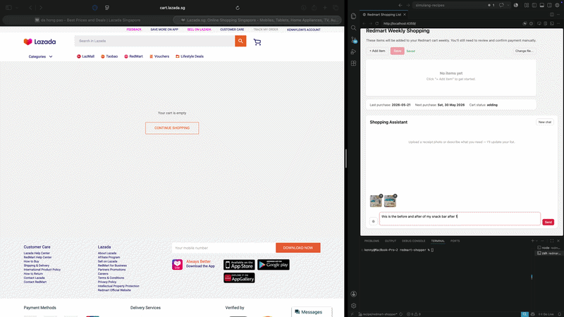

# Redmart Shopper

A weekly grocery automation for Redmart (Lazada SG). Manage your shopping list in a local web app, then let a Simulang script fill your Redmart cart every Saturday. You review and pay — the bot does everything else.

## Demo

<!-- A GIF or video showing the automation running -->


## Key APIs Used

- `AskModel.ask()` — reasons about search results to pick the best product and quantity combination
- `GroundingModel` + `screenshot.ground()` — visually locates and clicks buttons (Add to Cart, Select All, Delete, etc.)
- `App.defaultBrowser().open()` — focuses the browser and navigates to URLs
- `KeyboardController` — uses Cmd+L to navigate the address bar without opening new tabs
- `screenshotFull()` + `Image.fromBase64()` — captures the screen for vision model queries

## How to Run

### Prerequisites

- [simulang](https://simulang.dev) installed — run `simulang --version` in your terminal to check
- macOS with the following permissions granted to your terminal app (System Settings → Privacy & Security):
  - **Screen Recording** — so the script can take screenshots
  - **Automation** — so the script can locate the browser window via AppleScript
- **Safari or Chrome only** — the script uses AppleScript to locate the browser window; Firefox, Edge, and Brave are not supported
- Logged in to your Redmart account in Safari or Chrome
- An [OpenRouter](https://openrouter.ai) API key (free tier works)

---

### Step 1 — Set your API key

Open your terminal and run:

```bash
export OPENROUTER_API_KEY=your_key_here
```

To make this permanent (so you don't have to do it every time), add that line to your shell profile:

```bash
echo 'export OPENROUTER_API_KEY=your_key_here' >> ~/.zshrc
```

---

### Step 2 — Install dependencies

```bash
cd redmart-shopper
npm install && npm install --prefix shopping-client
```

---

### Step 3 — Set up your shopping list

Start the shopping list app:

```bash
npm run client
```

Then open **http://localhost:4359** in your browser.

**First time only:**
1. Click **Browse…** — a Finder window will open
2. Navigate to the `redmart-shopper` folder and select `save.json`
3. Click **Connect**

You'll now see your shopping list. Click **+ Add item** to add groceries:

| Field | What to enter |
|-------|---------------|
| **Name** | What you call the item, e.g. `Oat Milk` |
| **Description** | Specific details for the bot, e.g. `Oatside 1L oat milk` — the bot uses this to pick the right product and size |
| **Qty** | How many you want. If the description says `1L` and qty is `3`, the bot will pick 3× 1L or 1× 3L, whichever makes more sense |

Click **Save** when done. The app also shows:
- **Last purchase** — when the bot last ran
- **Next purchase** — the next Saturday the bot is due to run (turns red if overdue)
- **Cart status** — whether the bot is currently running, ready for payment, or errored

---

### Step 4 — Run the script manually (first test)

```bash
simulang run scripts/main.ts -- --force
```

Add `--verbose` to see every internal step (model responses, click coordinates, navigation):

```bash
simulang run scripts/main.ts -- --force --verbose
```

The `--force` flag bypasses the Saturday and 7-day checks so you can test any day. The bot will:
1. Clear your Redmart cart
2. Search for each item on your list
3. Add the right product and quantity to cart
4. Open the cart in your browser

Review the cart, then pay normally on Redmart.

#### Log levels

By default the script only prints high-level progress — which items were added and which were skipped. This is all most users need.

| Flag | What you see |
|------|-------------|
| *(none)* | Item results only — ✓ added, ⚠ skipped |
| `--verbose` | Everything: model responses, click coordinates, page navigation |

If you only care about what was skipped, just run without any flag and look for the yellow `⚠` lines.

---

### Step 5 — Schedule it to run every Saturday at 9am

This sets up a daily background job. Every morning at 9am it checks — if it's Saturday and at least 7 days have passed since the last shop, it runs automatically.

**1. Find the full path to your project folder:**
```bash
cd redmart-shopper && pwd
```
Copy the output — it will look something like `/Users/yourname/Documents/redmart-shopper`.

**2. Find the full path to simulang:**
```bash
which simulang
```
Copy that too — something like `/usr/local/bin/simulang`.

**3. Open your crontab:**
```bash
crontab -e
```
This opens a text editor. Add this line at the bottom (replacing the paths with yours):

```
0 9 * * * cd /Users/yourname/Documents/redmart-shopper && /usr/local/bin/simulang run scripts/main.ts >> /tmp/redmart-shopper.log 2>&1
```

Save and exit (in the default editor `vim`: press `Escape`, then type `:wq` and press Enter).

**4. Grant your terminal full disk and accessibility access** in System Settings → Privacy & Security if the script can't read files or click buttons when running in the background.

To check the log after a Saturday run:
```bash
cat /tmp/redmart-shopper.log
```

To force a run any time (skips the Saturday and schedule checks):
```bash
simulang run scripts/main.ts -- --force
```

---

## Workflow Diagram

```
[9am daily — cron job]
         │
         ▼
  Is today Saturday?  ──no──▶  exit silently
         │ yes
         ▼
  >= 7 days since     ──no──▶  log "next shop: <date>" → exit
  last purchase?
         │ yes
         ▼
  Set cartStatus = "adding"
  Write save.json
         │
         ▼
  ┌─────────────────────────────────────────┐
  │  For each item in shoppingList:         │
  │                                         │
  │  Search Redmart for item.name           │
  │       ↓                                 │
  │  Ask model picks best product +         │
  │  calculates how many units to add       │
  │  (e.g. need 3× 1L → picks 3× 1L pack   │
  │   or 1× 3L if available)               │
  │       ↓                                 │
  │  Grounding model clicks Add to Cart     │
  │       ↓                                 │
  │  If qty > 1: clicks + stepper           │
  │       ↓                                 │
  │  If no product found: skip item, warn   │
  └─────────────────────────────────────────┘
         │
         ▼
  Open cart in browser
  Set cartStatus = "ready"
  Set lastPurchaseDate = today
  Write save.json
         │
         ▼
  [You review cart and pay on Redmart]
```

## save.json Schema

```json
{
  "lastPurchaseDate": "2026-05-17",
  "cartStatus": "ready",
  "shoppingList": [
    {
      "id": "oat-milk",
      "name": "Oat Milk",
      "description": "Oatside 1L oat milk",
      "qty": 3
    }
  ]
}
```

| Field | Description |
|-------|-------------|
| `lastPurchaseDate` | Date of the last completed shop run (`YYYY-MM-DD`) |
| `cartStatus` | `pending` / `adding` / `ready` / `error` — see below |
| `shoppingList[].name` | Display name shown in the app |
| `shoppingList[].description` | Buying spec used by the AI to pick the right product |
| `shoppingList[].qty` | Total quantity to buy |

### cartStatus values

| Value | Meaning |
|-------|---------|
| `pending` | No run this week yet |
| `adding` | Bot is currently adding items |
| `ready` | Cart is loaded — go pay |
| `error` | Script failed — check logs |

## Notes

- **Why no auto-checkout?** Payment is irreversible. The bot always stops at a populated cart so you stay in control.
- **The bot picks wrong products?** Make your description more specific — include brand, size, and any preferences.
- **To stop a run mid-way:** Move your cursor to a corner of the screen or switch to another window.
- **Redmart login:** The bot uses your existing browser session — make sure you're logged in before the Saturday run.
