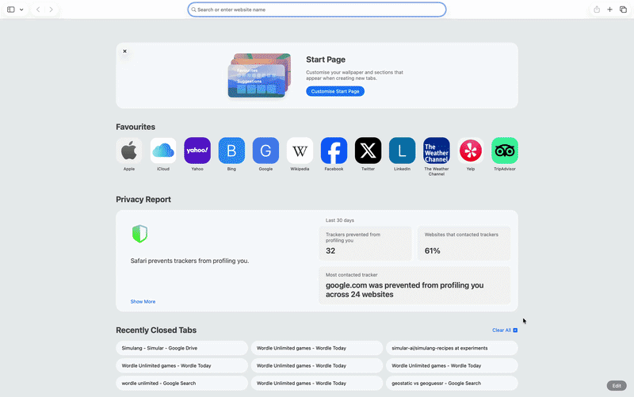

# Wordle

## Description

Opens Wordle Unlimited and plays automatically. Starts with the strong opener "CRANE", then uses `AskModel` each turn to read the coloured tiles from a screenshot, reason about the constraints, and suggest the next valid guess. Pure keyboard input — no coordinates, no clicking on game elements.

## Demo



## Key APIs Used

- `App.defaultBrowser().open()` — opens wordleunlimited.org
- `AskModel.default().ask()` — reads the tile colours (green/yellow/gray) from a screenshot, explains its reasoning, and outputs the best next 5-letter word
- `KeyboardController.text()` — types each letter with a small gap so the game registers each keypress
- `KeyboardController.key(Key.Return)` — submits the guess
- `MouseController` — clicks the tile grid once at startup and before each guess to ensure keyboard focus

## How to Run

**Prerequisites:**
- Simulang installed (`simulang run` available in your terminal)
- `OPENROUTER_API_KEY` required — [see setup instructions](../README.md#api-key-setup)
- `npm install` run once in this folder

**Steps:**
1. `cd wordle`
2. `simulang run main.ts`

## Workflow Diagram

```
[Open wordleunlimited.org]
  → [Click tile grid for keyboard focus]
  → [Type opener: CRANE]

Each turn (up to 6 guesses):
  [Screenshot → AskModel reads tile colours + reasons about constraints]
  → [Extract the 5-letter word from the last line of the response]
  → [Re-focus board → type word letter by letter → Enter]
  → [Check win/loss immediately after submission]
```

## Notes

- **Opener** — `CRANE` is set at the top of `main.ts`. Swap it for any other strong starter (e.g. `SLATE`, `AUDIO`, `RAISE`).
- **Repeat prevention** — all guessed words are tracked in a `Set`; if the LLM suggests a word already tried, it retries up to 5 times with the full history passed in the prompt.
- **Keyboard focus** — the board is re-clicked before every guess since long API calls can cause the browser to lose focus.
- **Limitations** — the LLM frequently misreads tile colours from the screenshot, applies constraints inconsistently, and occasionally hallucinates win/loss detection. In practice it rarely solves the puzzle within 6 guesses. The recipe demonstrates the pattern (screenshot → read → reason → type) but the accuracy is bottlenecked by vision reliability on small coloured tiles.
